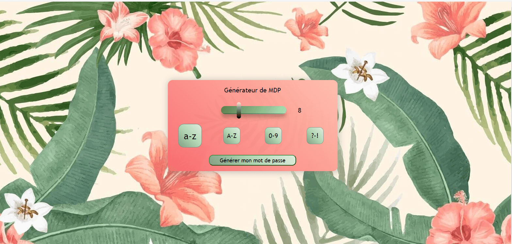

# Password-maker

All in the title

## Technos

## How to use it
+ Select a height
+ Check one of four parameters
+ Generate (automatically copied to clipboard)

## Additional comments
One of my first JS project. Surely not perfect, improveable in many ways (like all projects after all). But it's good to see were we come from.
